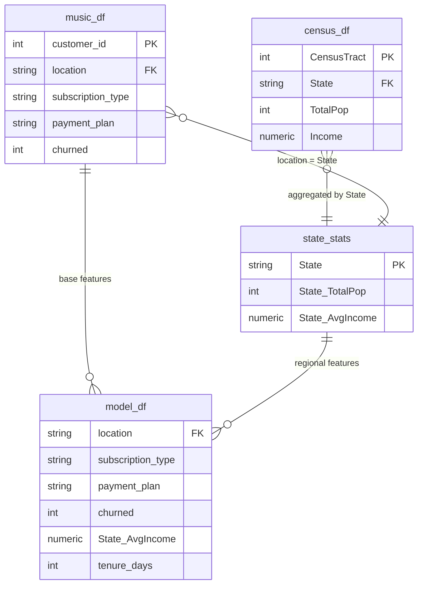

# SKN26-2nd-4Team

---

# 음악 구독 서비스 고객 이탈 예측 프로젝트

---

## 목차

1. [👑 Team JANI](#-team-jani)
2. [실행 환경](#실행-환경)
3. [인공지능 데이터 전처리 결과서](#인공지능-데이터-전처리-결과서)
   - [1. 프로젝트 개요](#1-프로젝트-개요)
   - [2. 데이터 기본 정보](#2-데이터-기본-정보)
   - [3. 기술 통계 및 데이터 요약](#3-기술-통계-및-데이터-요약)
   - [4. 결측치 및 이상치 탐색](#4-결측치-및-이상치-탐색)
   - [5. 변수 간 관계 분석](#5-변수-간-관계-분석)
   - [6. 파생 변수 생성 및 전처리 제안](#6-파생-변수-생성-및-전처리-제안)
   - [7. 요약 및 인사이트 도출](#7-요약-및-인사이트-도출)
4. [인공지능 학습 결과서](#인공지능-학습-결과서)
   - [Baseline Model Comparison](#baseline-model-comparison)
   - [Hyperparameter Tuning](#hyperparameter-tuning)
   - [ROC Curve Comparison](#roc-curve-comparison)
   - [Final Model Selection](#final-model-selection)
5. [동료 회고](#동료-회고)

---

# 👑 Team JANI
### Joined Again, Never Interrupted

<table align="center">
  <tr>
    <td align="center" width="125" valign="top">
      <table align="center" width="105">
        <tr>
          <td align="center" height="120">
            
          </td>
        </tr>
        <tr>
          <td align="center" height="36"><b>김지윤</b></td>
        </tr>
        <tr>
          <td align="center" height="44">
            <a href="https://github.com/JiyounKim-EllyKim">@JiyounKim</a>
          </td>
        </tr>
      </table>
    </td>
    <td align="center" width="125" valign="top">
      <table align="center" width="105">
        <tr>
          <td align="center" height="120">
            
          </td>
        </tr>
        <tr>
          <td align="center" height="36"><b>박민선</b></td>
        </tr>
        <tr>
          <td align="center" height="44">
            <a href="https://github.com/ParkMinseon22">@ParkMinseon22</a>
          </td>
        </tr>
      </table>
    </td>
    <td align="center" width="125" valign="top">
      <table align="center" width="105">
        <tr>
          <td align="center" height="120">
            
          </td>
        </tr>
        <tr>
          <td align="center" height="36"><b>박소윤</b></td>
        </tr>
        <tr>
          <td align="center" height="44">
            <a href="https://github.com/parksoyun9084-cloud">@parksoyun</a>
          </td>
        </tr>
      </table>
    </td>
    </td>
    <td align="center" width="125" valign="top">
      <table align="center" width="105">
        <tr>
          <td align="center" height="120">
            
          </td>
        </tr>
        <tr>
          <td align="center" height="36"><b>윤지혜</b></td>
        </tr>
        <tr>
          <td align="center" height="44">
            <a href="https://github.com/jjhhyy0926">@jjhhyy0926</a>
          </td>
        </tr>
      </table>
    </td>
    <td align="center" width="125" valign="top">
      <table align="center" width="105">
        <tr>
          <td align="center" height="120">
            
          </td>
        </tr>
        <tr>
          <td align="center" height="36"><b>이레</b></td>
        </tr>
        <tr>
          <td align="center" height="44">
            <a href="https://github.com/leere2424">@leere2424</a>
          </td>
        </tr>
      </table>
    <td align="center" width="125" valign="top">
      <table align="center" width="105">
        <tr>
          <td align="center" height="120">
            
          </td>
        </tr>
        <tr>
          <td align="center" height="36"><b>최수아</b></td>
        </tr>
        <tr>
          <td align="center" height="44">
            <a href="https://github.com/sooa02">@sooa02</a>
          </td>
        </tr>
      </table>
    </td>
  </tr>
</table>

<table align="center" width="100%" style="border-collapse: collapse; text-align: center;">
  <tr>
    <th style="border:1px solid #d0d7de; padding:12px; background-color:#f6f8fa;">이름</th>
    <th style="border:1px solid #d0d7de; padding:12px; background-color:#f6f8fa;">역할</th>
  </tr>

  <tr>
    <td style="border:1px solid #d0d7de; padding:12px;"><b>김지윤</b></td>
    <td style="border:1px solid #d0d7de; padding:12px; text-align:left;">
      Engagement 기반 RFM 테이블 설계, 데이터 전처리 및 모델링 모듈화, Kmeans 클러스터링 및 사용자 유형 분석
    </td>
  </tr>

  <tr>
    <td style="border:1px solid #d0d7de; padding:12px;"><b>박민선</b></td>
    <td style="border:1px solid #d0d7de; padding:12px; text-align:left;">
      예측 모델 설계, 상관관계 기반 가설 설정 및 분석, Streamlit 대시보드 시각화 구현
    </td>
  </tr>

  <tr>
    <td style="border:1px solid #d0d7de; padding:12px;"><b>박소윤</b></td>
    <td style="border:1px solid #d0d7de; padding:12px; text-align:left;">
      데이터 전처리, 데이터 분석 및 시각화, 머신러닝 모델 최적화 및 고도화 , 발표 PPT 제작
    </td>
  </tr>

  <tr>
    <td style="border:1px solid #d0d7de; padding:12px;"><b>윤지혜</b></td>
    <td style="border:1px solid #d0d7de; padding:12px; text-align:left;">
      EDA 기반 가설 검증 시각화 분석, 최적 모델 선정, 하이퍼파라미터 튜닝을 통한 모델 성능 최적화
    </td>
  </tr>

  <tr>
    <td style="border:1px solid #d0d7de; padding:12px;"><b>이레</b></td>
    <td style="border:1px solid #d0d7de; padding:12px; text-align:left;">
      주제 기획 및 제안, 데이터 전처리 및 EDA, 예측모델 설계 및 클러스터링 함수 모듈화, 결과서 작성
    </td>
  </tr>

  <tr>
    <td style="border:1px solid #d0d7de; padding:12px;"><b>최수아</b></td>
    <td style="border:1px solid #d0d7de; padding:12px; text-align:left;">
      데이터 전처리 총괄 및 결과서 작성, EDA 수행, 가설 설정 및 검증, ERD 설계, Notion 및 회의록 작성
    </td>
  </tr>

</table>


---

# 실행 환경

- Python 3.11 ⇒ 
  - Streamlit 1.30+
  - 주요 라이브러리: pandas, numpy, scikit-learn, lightgbm, catboost, shap, matplotlib, seaborn
  - 머신러닝 프레임워크: pytorch

---

# 인공지능 데이터 전처리 결과서
상세 내용: https://ohgiraffers.notion.site/322649136c1180adb1b5fb2eca913618?source=copy_link

## 1. 프로젝트 개요

- 목적: 음악 구독 서비스 고객의 이탈(`churned`) 예측을 위해 데이터 구조를 파악하고, 전처리 및 병합 결과를 점검하여 모델링 가능한 분석용 데이터를 구축한다.
- 데이터 출처
    - 고객 데이터: Kaggle `Streaming Subscription Churn Model`
    - 지역 데이터: Kaggle `US Census Demographic Data`
- 데이터 구성
    - 고객 원천 데이터(`music_df`): 125,000행, 20개 컬럼
    - Census 원천 데이터(`census_df`): 74,001행, 37개 컬럼
    - 최종 분석 데이터(`final_df` → `model_df`): 125,000행, 20개 컬럼
- 비고
    - 노트북에서는 전처리 후 `final_df`를 만들고, 이를 `model_df`로 복사하여 EDA를 수행했다.
    - 최종 데이터는 범주형 5개, 수치형 15개(타깃 포함)로 구성된다.

## 1.1. 데이터 테이블 관계

본 프로젝트의 데이터는 원천 테이블 2개와 파생 테이블 2개로 구성된다.

### ERD 구조



### 1. `music_df`
음악 구독 사용자 단위 원천 데이터이다.

### 2. `census_df`
미국 Census tract 단위 인구/소득 데이터이다.

### 3. `state_stats`
`census_df`를 `State` 기준으로 집계한 파생 테이블이다.

- `State_TotalPop`: 주별 총인구
- `State_AvgIncome`: 주별 평균소득

### 4. `model_df`
최종 모델링용 데이터셋이다.  
`music_df`를 기준으로 `location = State` 조건으로 `state_stats`를 left join하여 생성하였다.

최종적으로 `model_df`는 고객 행동 데이터와 지역 소득 데이터를 결합한 고객 이탈 예측용 피처 테이블이다.

---

## 1.2. 프로젝트 구조 및 모듈 설계

```text
JANI/
├── 01_data/                                # 데이터 저장 폴더
│   ├── processed/                          # 전처리 완료 데이터
│   │   └── model_df.csv                    # 모델 학습용 데이터
│   │                        
│   └── raw/                                # 원본 데이터
│       ├── acs2015_census_tract_data.csv   # 지역 사회경제 데이터
│       └── train.csv                       # 고객 행동 데이터
│
├── 02_notebooks/                           # 분석 및 실험 노트북
│   ├── 01_EDA_Preprocessing/
│   │   └── preprocessing_eda_mapping.ipynb # EDA 및 데이터 전처리
│   │
│   └── 02_Modeling/
│   │   ├── catboost_info/                  # CatBoost 학습 로그
│   │   ├── 01_model_comparison.ipynb       # 다양한 ML 모델 비교
│   │   └── 02_model_tuning.ipynb           # HyperOpt 기반 파라미터 튜닝
│   │
│   └── 03_Clustering/
│       └── clustering_analysis.ipynb       # RFM 기반 고객 군집 분석
│
├── 03_models/
│   ├── artifacts/                          # 학습된 모델 및 전처리 객체 저장
│   └── models/
│       └── train_final_model.ipynb         # 최종 모델 학습
│
├── 04_app/
│   └── app.py                              # Streamlit 기반 예측 앱
│
├── figures/
│   └── result_roc.png                      # 최종 모델 ROC Curve 이미지
│
├── src/                                    # 프로젝트 핵심 코드 모듈
│   ├── __init__.py
│   ├── clustering.py                       # RFM 기반 고객 세그먼트 분석 (KMeans)
│   ├── evaluation.py                       # 모델 성능 평가 및 시각화
│   ├── model_comparison.py                 # ML 모델 학습 및 비교
│   ├── model_tuning.py                     # HyperOpt 기반 하이퍼파라미터 튜닝
│   └── preprocessing.py                    # 데이터 전처리 (LabelEncoder, Scaler)
│                         
├── .gitignore
├── LICENSE
└── README.md
```

---

## 2. 데이터 기본 정보

- 총 데이터 수: 125,000개
- 컬럼 수: 20개
- 타깃 변수: `churned`
- 주요 컬럼
    - 인구통계/지역: `age`, `location`, `State_AvgIncome`, `tenure_days`
    - 구독/결제: `subscription_type`, `payment_plan`, `payment_method`, `num_subscription_pauses`
    - 행동: `weekly_hours`, `average_session_length`, `song_skip_rate`, `weekly_songs_played`, `weekly_unique_songs`
    - 선호/활동: `num_favorite_artists`, `num_platform_friends`, `num_playlists_created`, `num_shared_playlists`, `notifications_clicked`
    - 고객 응대: `customer_service_inquiries`

### 변수 타입 구성

- 범주형 컬럼(5개)
    
    `location`, `subscription_type`, `payment_plan`, `payment_method`, `customer_service_inquiries`
    
- 수치형 컬럼(15개)
    
    `age`, `num_subscription_pauses`, `weekly_hours`, `average_session_length`, `song_skip_rate`,
    
    `weekly_songs_played`, `weekly_unique_songs`, `num_favorite_artists`, `num_platform_friends`,
    
    `num_playlists_created`, `num_shared_playlists`, `notifications_clicked`, `State_AvgIncome`,
    
    `tenure_days`, `churned`
    

### 타깃 분포

- 이탈(`churned=1`): 64,174명 (51.34%)
- 유지(`churned=0`): 60,826명 (48.66%)

---

## 3. 기술 통계 및 데이터 요약

### 3.1 수치형 변수 요약

| 컬럼명 | 평균 | 중앙값 | 표준편차 | 최솟값 | 최댓값 |
| --- | --- | --- | --- | --- | --- |
| `age` | 48.4141 | 48.0000 | 17.9010 | 18.0000 | 79.0000 |
| `num_subscription_pauses` | 1.9911 | 2.0000 | 1.4172 | 0.0000 | 4.0000 |
| `weekly_hours` | 25.0370 | 25.1167 | 14.4475 | 0.0001 | 49.9999 |
| `average_session_length`* | 1.0070 | 1.0057 | 0.5731 | 0.0167 | 2.0000 |
| `song_skip_rate` | 0.5008 | 0.5012 | 0.2887 | 0.0000 | 1.0000 |
| `weekly_songs_played` | 250.8239 | 251.0000 | 143.3276 | 3.0000 | 499.0000 |
| `tenure_days` | 1460.6789 | 1462.0000 | 844.1329 | 1.0000 | 2922.0000 |

### 3.2 범주형 변수 요약

| 컬럼명 | 고유값 수 | 분포 요약 |
| --- | --- | --- |
| `subscription_type` | 4 | Premium 25.08%, Student 25.04%, Free 25.02%, Family 24.86% |
| `payment_plan` | 2 | Monthly 50.05%, Yearly 49.95% |
| `payment_method` | 4 | Debit Card 25.03%, Paypal 25.03%, Credit Card 24.97%, Apple Pay 24.97% |
| `customer_service_inquiries` | 3 | Low 33.50%, High 33.27%, Medium 33.24% |
| `location` | 19 | 19개 주로 구성, 각 주 고객 수는 약 6,401~6,705명 수준 |

---

## 4. 결측치 및 이상치 탐색

## 4.1 결측치 점검

### 원천 데이터 결측치

- 고객 데이터(`music_df`): 전 컬럼 결측치 0건
- Census 데이터(`census_df`)
    - `Income`: 1,100건 결측
    - 처리 방법: `State`별 중앙값으로 대체
    - 처리 후 `Income` 결측치: 0건

### 최종 분석 데이터 결측치

병합 후 `State`, `_merge`, `State_TotalPop`을 제거한 최종 데이터에서 모든 컬럼의 결측치는 0건이다.

| 컬럼 | 결측치 수 | 컬럼 | 결측치 수 |
| --- | --- | --- | --- |
| `location` | 0 | `weekly_unique_songs` | 0 |
| `age` | 0 | `num_favorite_artists` | 0 |
| `subscription_type` | 0 | `num_platform_friends` | 0 |
| `payment_plan` | 0 | `num_playlists_created` | 0 |
| `payment_method` | 0 | `num_shared_playlists` | 0 |
| `num_subscription_pauses` | 0 | `notifications_clicked` | 0 |
| `weekly_hours` | 0 | `customer_service_inquiries` | 0 |
| `average_session_length` | 0 | `churned` | 0 |
| `song_skip_rate` | 0 | `State_AvgIncome` | 0 |
| `weekly_songs_played` | 0 | `tenure_days` | 0 |

### 병합 상태 점검

- `both`: 125,000건 (100.00%)
- `left_only`: 0건
- `right_only`: 0건

---

## 4.2 이상치 탐색

### 적용 방법

- IQR(사분위 범위) 기반 이상치 탐색
- boxplot, histogram을 통한 분포 확인
- 전처리 후 논리 정합성 검사 수행

### 이상치 탐색 결과

IQR 기준 탐색에서는 별도의 극단치가 확인되지 않았다. 이는 데이터가 일정 범위 내에서 생성되었거나 전처리 과정에서 정합성이 확보된 결과로 해석된다.

### 전처리 후 논리 점검 결과

아래 조건 위반 건수는 모두 0건이었다.

- `weekly_unique_songs > weekly_songs_played`
- `average_session_length <= 0`
- `song_skip_rate < 0 or > 1`
- `weekly_hours < 0`
- `tenure_days < 0`

---

## 5. 변수 간 관계 분석

전처리 중심 EDA 단계에서는 변수 간 관계를 탐색 수준에서 점검하였다.

### 5.1 시각화

노트북에서 확인한 주요 시각화는 다음과 같다.

- `churned` 분포 countplot
- 수치형 변수 상관계수 heatmap
- `song_skip_rate`, `weekly_hours` 등의 histogram
- `tenure_days`의 churn 그룹별 boxplot
- 범주형 변수별 churn rate barplot
- 주 평균 소득과 churn rate 간 scatter plot

### 5.2 수치형 변수 상관관계

`churned`와의 주요 상관계수는 다음과 같다.

| 변수 | `churned`와의 상관계수 |
| --- | --- |
| `weekly_hours`  | -0.3025 |
| `num_subscription_pauses` | 0.1830 |
| `song_skip_rate` | 0.1602 |
| `age` | 0.0487 |
| `notifications_clicked` | -0.0424 |
| `tenure_days` | 0.0012 |
| `State_AvgIncome` | 0.0004 |

### 해석

- `weekly_hours`가 가장 큰 절대 상관을 보이며, 사용 시간이 많을수록 이탈 가능성이 낮아지는 방향이다.
- `num_subscription_pauses`, `song_skip_rate`는 이탈을 높이는 방향의 행동 변수다.

### 5.3 범주형 변수 그룹 비교

카이제곱 검정 결과, churn과의 관계가 특히 뚜렷한 변수는 다음과 같았다.

- `subscription_type`: p < 0.001
- `customer_service_inquiries`: p < 0.001
- `payment_method`: p = 0.0430

### 범주별 churn rate

- `subscription_type`
    - Free: 79.41%
    - Student: 57.39%
    - Family: 34.58%
    - Premium: 33.91%
- `customer_service_inquiries`
    - High: 74.33%
    - Medium: 50.92%
    - Low: 28.92%
- `payment_plan`
    - Monthly: 51.41%
    - Yearly: 51.27%

### 해석

- 구독 유형과 고객 문의 수준 컬럼이 churn과의 관계가 강하게 나타났다.

---

## 6. 파생 변수 생성 및 전처리 제안

### 6.1 실제 적용된 전처리

이번 전처리에서 실제로 반영된 사항은 다음과 같다.

1. 오타 수정
    - `location`: `Nebrasksa` → `Nebraska`
2. 불필요 식별자 제거
    - `customer_id` 삭제
3. 단위 변환
    - `average_session_length`를 분 단위 → 시간 단위로 변환
4. 논리 보정
    - `weekly_unique_songs > weekly_songs_played`인 경우
        
        `weekly_unique_songs = weekly_songs_played`로 보정
        
5. 파생 변수 생성
    - `tenure_days = abs(signup_date)` 생성
    - 기존 `signup_date` 삭제
6. 외부 데이터 집계 및 병합
    - Census `Income` 결측치를 `State`별 중앙값으로 대체
    - `State` 단위 평균 소득 변수 `State_AvgIncome` 생성
    - `State_TotalPop`은 집계했지만 최종 분석 데이터에서는 제거

### 6.2 추가 전처리 제안

모델링 단계에서 고려할 수 있는 추가 전처리 방법은 다음과 같다.

- 범주형 인코딩
    - `subscription_type`, `payment_plan`, `payment_method`, `location`은 원-핫 인코딩 적용 가능
    - `customer_service_inquiries`는 필요 시 `Low < Medium < High`의 순서형 매핑 가능
- 구간화(Binning)
    - `age`, `weekly_hours`, `tenure_days`는 해석력 향상을 위해 구간화 가능
    - 예: `weekly_hours` → `Low / Medium / High`
- 스케일링
    - Logistic Regression, MLP 계열 모델에는 수치형 변수 표준화 권장
    - Tree 계열 모델(Random Forest, LightGBM 등)은 스케일링 필요성 낮음

---

## 7. 요약 및 인사이트 도출

### 7.1 주요 특징 정리

- 고객 데이터와 Census 데이터를 결합한 통합 분석 데이터셋을 구축했다.
- `location` 오타 수정 이후 병합에 성공했다.
- 원천 고객 데이터는 결측치가 없었고, Census의 `Income` 결측치 1,100건은 `State`별 중앙값으로 처리했다.
- 최종 분석 데이터는 125,000행, 20개 컬럼이며, 결측치가 없는 상태로 정리되었다.
- 논리 정합성 검사 결과 이상값 조건 위반은 모두 0건이었다.
- IQR 기준 이상치도 전 변수에서 0건으로 확인되었다.

### 7.2 전처리 관점 핵심 인사이트

- 현재 데이터는 구조적으로 안정적이며, 기본적인 결측치 처리와 병합, 변수 보정이 완료된 상태다.
- 지역 변수보다는 행동 변수(`weekly_hours`, `song_skip_rate`, `num_subscription_pauses`)와
    - 고객 응대 변수(`customer_service_inquiries`)가 더 강한 신호를 보인다.
- `State_AvgIncome`, `tenure_days`는 존재 자체는 의미가 있으나, 현재 기준으로는 우선순위가 낮다.

### 7.3 모델링 방향성

- 현 시점의 `model_df`는 기초 모델링에 바로 활용 가능한 상태다.
- 이후 모델링에서는 다음 변수를 우선 고려하는 것이 타당하다.
    - `weekly_hours`
    - `num_subscription_pauses`
    - `song_skip_rate`
    - `subscription_type`
    - `customer_service_inquiries`
- 선형 모델/신경망 계열에는 범주형 인코딩 + 수치형 스케일링을 추가 적용하는 것이 바람직하다.

---

# 인공지능 학습 결과서
상세 내용: https://ohgiraffers.notion.site/322649136c11804898dacdb45ca3f276?source=copy_link

본 문서는 음악 스트리밍 서비스 사용자 데이터를 기반으로 구독 이탈 예측 모델을 학습하고 성능을 비교한 결과를 정리한 것이다.  
여러 머신러닝 모델을 이용하여 baseline 성능을 비교하고, 이후 Boosting 기반 모델을 중심으로 하이퍼파라미터 튜닝을 수행하였다.  
각 모델의 Accuracy, F1-score, ROC-AUC를 기반으로 성능을 분석하고 최종 모델을 선정하였다.

---

## Baseline Model Comparison

다양한 머신러닝 모델을 사용하여 **baseline 성능 비교**를 진행하였다.

### Validation Performance

| Model | Accuracy                                                  | F1                                                        | ROC-AUC                                                   |
|------|-----------------------------------------------------------|-----------------------------------------------------------|-----------------------------------------------------------|
| LogisticRegression | 0.674                                                     | 0.688                                                     | 0.746                                                     |
| SVC | 0.781                                                     | 0.788                                                     | 0.869                                                     |
| CatBoost | <strong><span style="color:#e74c3c">0.839</span></strong> | <strong><span style="color:#e74c3c">0.842</span></strong> | <strong><span style="color:#e74c3c">0.936</span></strong> |
| XGBoost | <strong><span style="color:#e74c3c">0.841</span></strong> | <strong><span style="color:#e74c3c">0.845</span></strong> | <strong><span style="color:#e74c3c">0.937</span></strong> |
| LightGBM | <strong><span style="color:#e74c3c">0.805</span></strong> | <strong><span style="color:#e74c3c">0.808</span></strong> | <strong><span style="color:#e74c3c">0.895</span></strong> |
| RandomForest | 0.805                                                     | 0.808                                                     | 0.895                                                     |

Baseline 비교 결과 **Gradient Boosting 계열 모델(CatBoost, XGBoost, LightGBM)** 이 가장 높은 성능을 보였다.  
따라서 해당 모델들을 중심으로 **하이퍼파라미터 튜닝을 진행하였다.**

---

## Hyperparameter Tuning

Boosting 모델에 대해 **HyperOpt 기반 Bayesian Optimization (TPE)** 을 이용하여  
하이퍼파라미터 탐색을 진행하였다.

### Final Performance

| Model | Accuracy                                                   | F1                                                         |
|------|------------------------------------------------------------|------------------------------------------------------------|
| XGBoost | <strong><span style="color:red">**0.8483**</span></strong> | <strong><span style="color:red">**0.8507**</span></strong> | 
| LightGBM | 0.8481                                                     | 0.8502                                                     |
| CatBoost | 0.8471                                                     | 0.8470                                                     |

세 모델 모두 약 **0.84 수준의 Accuracy와 F1-score**를 기록하며 매우 유사한 성능을 보였다.

---

## ROC Curve Comparison

<p align="center">

</p>

세 모델 모두 **ROC-AUC 약 0.94 수준의 높은 분류 성능**을 보였다.

| Model | ROC-AUC                                                |
|------|--------------------------------------------------------|
| XGBoost | <strong><span style="color:red">0.9419</span></strong> |
| LightGBM | 0.9420                                                 |
| CatBoost | 0.9415                                                 |

---

## Final Model Selection

튜닝 결과 세 Boosting 모델은 모두 유사한 성능을 보였으며,  
그 중 **XGBoost 모델이 가장 높은 성능을 기록하였다.**

따라서 본 프로젝트의 **최종 모델은 XGBoost로 선정하였다.**

---

# 동료 회고

<table style="width: 100%; border-collapse: collapse; border: 1px solid #ddd; margin-bottom: 30px;">
    <thead>
        <tr style="background-color: #f8f9fa;">
            <th style="width: 15%; border: 1px solid #ddd; padding: 10px;">작성자</th>
            <th style="width: 15%; border: 1px solid #ddd; padding: 10px;">대상자</th>
            <th style="border: 1px solid #ddd; padding: 10px;">회고 내용</th>
        </tr>
    </thead>
    <tbody>
        <tr>
            <td rowspan="5" style="text-align: center; font-weight: bold; border: 1px solid #ddd;">김지윤</td>
            <td style="text-align: center; border: 1px solid #ddd;">박민선</td>
            <td style="border: 1px solid #ddd; padding: 10px;"> 내용 </td>
        </tr>
        <tr>
            <td style="text-align: center; border: 1px solid #ddd;">박소윤</td>
            <td style="border: 1px solid #ddd; padding: 10px;"> 내용 </td>
        </tr>
        <tr>
            <td style="text-align: center; border: 1px solid #ddd;">윤지혜</td>
            <td style="border: 1px solid #ddd; padding: 10px;"> 내용 </td>
        </tr>
        <tr>
            <td style="text-align: center; border: 1px solid #ddd;">이레</td>
            <td style="border: 1px solid #ddd; padding: 10px;"> 내용 </td>
        </tr>
        <tr>
            <td style="text-align: center; border: 1px solid #ddd;">최수아</td>
            <td style="border: 1px solid #ddd; padding: 10px;"> 내용 </td>
        </tr>
    </tbody>
</table>

<table style="width: 100%; border-collapse: collapse; border: 1px solid #ddd; margin-bottom: 30px;">
    <thead>
        <tr style="background-color: #f8f9fa;">
            <th style="width: 15%; border: 1px solid #ddd; padding: 10px;">작성자</th>
            <th style="width: 15%; border: 1px solid #ddd; padding: 10px;">대상자</th>
            <th style="border: 1px solid #ddd; padding: 10px;">회고 내용</th>
        </tr>
    </thead>
    <tbody>
        <tr>
            <td rowspan="5" style="text-align: center; font-weight: bold; border: 1px solid #ddd;">박민선</td>
            <td style="text-align: center; border: 1px solid #ddd;">김지윤</td>
            <td style="border: 1px solid #ddd; padding: 10px;">전반적인 프로젝트 진행을 주도하며 Engagement 기반의 RFM 테이블을 설계하고 전체적인 틀을 잡아주셔서 프로젝트 방향을 명확하게 설정할 수 있었습니다. 또한 꼼꼼한 데이터 전처리와 모델링 모듈화를 통해 코드 가독성을 높여 주셔서 프로젝트가 원활하게 진행되는 데 큰 도움이 되었습니다.</td>
        </tr>
        <tr>
            <td style="text-align: center; border: 1px solid #ddd;">박소윤</td>
            <td style="border: 1px solid #ddd; padding: 10px;">데이터 전처리와 분석, 시각화를 통해 데이터의 특성을 명확하게 정리해 주셨고, 머신러닝 모델 최적화와 고도화를 통해 모델 성능 향상에 기여해 주셨습니다. 또한 발표 PPT 제작을 맡아 프로젝트 결과를 이해하기 쉽게 정리해 주셔서 전체 발표 완성도가 높아졌습니다.</td>
        </tr>
        <tr>
            <td style="text-align: center; border: 1px solid #ddd;">윤지혜</td>
            <td style="border: 1px solid #ddd; padding: 10px;">EDA 기반의 가설 검증을 위한 시각화 분석을 통해 데이터 인사이트를 도출해 주셨고, 다양한 모델을 비교하여 최적 모델을 선정해 주셨습니다. 또한 하이퍼파라미터 튜닝을 통해 모델 성능을 체계적으로 개선해 주셔서 프로젝트의 예측 정확도를 높이는 데 도움이 되었습니다.</td>
        </tr>
        <tr>
            <td style="text-align: center; border: 1px solid #ddd;">이레</td>
            <td style="border: 1px solid #ddd; padding: 10px;">프로젝트 주제를 기획하고 방향성을 제안해 주셔서 초기 설계 단계에서 큰 도움이 되었습니다. 또한 데이터 전처리와 EDA를 통해 데이터 이해도를 높이고, 예측 모델 설계와 클러스터링 함수 모듈화를 통해 코드 구조를 체계적으로 정리해 주셨습니다. 최종 결과서를 작성해 주셔서 프로젝트의 분석 과정과 결과를 체계적으로 정리하는 데 기여해 주셨습니다.</td>
        </tr>
        <tr>
            <td style="text-align: center; border: 1px solid #ddd;">최수아</td>
            <td style="border: 1px solid #ddd; padding: 10px;">데이터 전처리를 총괄하며 데이터 품질을 안정적으로 관리해 주셨고, EDA 수행과 가설 설정 및 검증을 통해 분석의 방향성을 명확하게 잡아주셨습니다. 또한 ERD 설계와 Notion 및 회의록 정리를 통해 프로젝트 진행 과정을 체계적으로 관리해 주셔서 협업이 원활하게 이루어질 수 있었습니다.</td>
        </tr>
    </tbody>
</table>

<table style="width: 100%; border-collapse: collapse; border: 1px solid #ddd; margin-bottom: 30px;">
    <thead>
        <tr style="background-color: #f8f9fa;">
            <th style="width: 15%; border: 1px solid #ddd; padding: 10px;">작성자</th>
            <th style="width: 15%; border: 1px solid #ddd; padding: 10px;">대상자</th>
            <th style="border: 1px solid #ddd; padding: 10px;">회고 내용</th>
        </tr>
    </thead>
    <tbody>
        <tr>
            <td rowspan="5" style="text-align: center; font-weight: bold; border: 1px solid #ddd;">박소윤</td>
            <td style="text-align: center; border: 1px solid #ddd;">김지윤</td>
            <td style="border: 1px solid #ddd; padding: 10px;">Engagement 기반의 RFM 테이블을 정교하게 설계하여 사용자 행동을 다각도로 해석할 수 있는 기반을 마련해 주셨습니다. 군집 분석을 통해 실질적인 비즈니스 인사이트를 도출하는 과정에서도 논리적인 설득력을 보여주었습니다. </td>
        </tr>
        <tr>
            <td style="text-align: center; border: 1px solid #ddd;">박민선</td>
            <td style="border: 1px solid #ddd; padding: 10px;">분석 결과를 로컬 파일에 머물게 하지 않고, Streamlit 기반의 실시간 대시보드로 구현하여 데이터 기반 의사결정 환경을 구축한 점이 프로젝트의 완성도를 크게 높였습니다.</td>
        </tr>
        <tr>
            <td style="text-align: center; border: 1px solid #ddd;">윤지혜</td>
            <td style="border: 1px solid #ddd; padding: 10px;">가설을 시각적으로 검증하며 분석의 객관성을 확보해 주셨습니다. 특히 하이퍼파라미터 튜닝을 통해 모델 성능을 극한으로 끌어올리신 기술적 역량 덕분에 분석 결과에 대한 신뢰도를 확보할 수 있었습니다.</td>
        </tr>
        <tr>
            <td style="text-align: center; border: 1px solid #ddd;">이레</td>
            <td style="border: 1px solid #ddd; padding: 10px;">클러스터링 및 예측 함수를 모듈화하여 팀 전체의 작업 속도를 높였으며, 전처리부터 결과서 작성까지 프로젝트의 흐름을 놓치지 않고 챙겨주신 덕분에 전체적인 작업이 유기적으로 진행될 수 있었습니다.</td>
        </tr>
        <tr>
            <td style="text-align: center; border: 1px solid #ddd;">최수아</td>
            <td style="border: 1px solid #ddd; padding: 10px;">전처리 전 과정을 챙기며 데이터의 정합성을 확보해 주었으며, 분석 과정에서의 주요 의사결정 사항과 기술적 이슈를 기록하여 팀 내 정보 공유가 원활하게 이루어지는 데 도움을 주었습니다.</td>
        </tr>
    </tbody>
</table>

<table style="width: 100%; border-collapse: collapse; border: 1px solid #ddd; margin-bottom: 30px;">
    <thead>
        <tr style="background-color: #f8f9fa;">
            <th style="width: 15%; border: 1px solid #ddd; padding: 10px;">작성자</th>
            <th style="width: 15%; border: 1px solid #ddd; padding: 10px;">대상자</th>
            <th style="border: 1px solid #ddd; padding: 10px;">회고 내용</th>
        </tr>
    </thead>
    <tbody>
        <tr>
            <td rowspan="5" style="text-align: center; font-weight: bold; border: 1px solid #ddd;">윤지혜</td>
            <td style="text-align: center; border: 1px solid #ddd;">김지윤</td>
            <td style="border: 1px solid #ddd; padding: 10px;">RFM 테이블을 Engagement 기준으로 설계하면서 사용자 행동 데이터를 구조화하는 데 중요한 역할을 해주었다. 특히 클러스터링 분석을 진행하면서 사용자 유형을 정리하고, 모델링 코드를 모듈화하여 프로젝트 코드 구조를 정리하는 데에도 도움이 되었다.</td>
        </tr>
        <tr>
            <td style="text-align: center; border: 1px solid #ddd;">박민선</td>
            <td style="border: 1px solid #ddd; padding: 10px;">예측 모델 설계와 가설 분석을 통해 고객 이탈에 영향을 줄 수 있는 요인을 분석하는 과정에서 좋은 인사이트를 제공해 주었다. 또한 Streamlit 대시보드를 구현하여 분석 결과를 직관적으로 확인할 수 있도록 만든 점이 프로젝트 완성도를 높이는 데 큰 도움이 되었다.</td>
        </tr>
        <tr>
            <td style="text-align: center; border: 1px solid #ddd;">박소윤</td>
            <td style="border: 1px solid #ddd; padding: 10px;">데이터 전처리와 시각화를 통해 데이터의 특징을 이해하는 과정에서 많은 기여를 해주었다. 또한 발표 PPT를 체계적으로 정리하여 프로젝트 결과를 잘 전달할 수 있도록 도와주었다.</td>
        </tr>
        <tr>
            <td style="text-align: center; border: 1px solid #ddd;">이레</td>
            <td style="border: 1px solid #ddd; padding: 10px;">프로젝트 주제 기획 단계에서 분석 방향을 잡는 데 적극적으로 참여해 주었다. EDA와 모델 설계 과정에서 데이터 기반으로 문제를 정리하여 주었고, 클러스터링 함수 모듈화와 결과서 작성까지 맡아 프로젝트 정리에 큰 도움을 주었다.</td>
        </tr>
        <tr>
            <td style="text-align: center; border: 1px solid #ddd;">최수아</td>
            <td style="border: 1px solid #ddd; padding: 10px;">데이터 전처리를 총괄하면서 데이터 정리와 관리가 안정적으로 이루어질 수 있도록 도와주었다. EDA와 가설 검증 과정에서도 꾸준히 의견을 제시해 주었고, ERD 설계와 Notion 정리를 통해 팀 협업과 프로젝트 진행 상황을 잘 관리해주어 팀 프로젝트가 수월히 진행되는데 도움을 주었다</td>
        </tr>
    </tbody>
</table>

<table style="width: 100%; border-collapse: collapse; border: 1px solid #ddd; margin-bottom: 30px;">
    <thead>
        <tr style="background-color: #f8f9fa;">
            <th style="width: 15%; border: 1px solid #ddd; padding: 10px;">작성자</th>
            <th style="width: 15%; border: 1px solid #ddd; padding: 10px;">대상자</th>
            <th style="border: 1px solid #ddd; padding: 10px;">회고 내용</th>
        </tr>
    </thead>
    <tbody>
        <tr>
            <td rowspan="5" style="text-align: center; font-weight: bold; border: 1px solid #ddd;">이레</td>
            <td style="text-align: center; border: 1px solid #ddd;">김지윤</td>
            <td style="border: 1px solid #ddd; padding: 10px;"> 내용 </td>
        </tr>
        <tr>
            <td style="text-align: center; border: 1px solid #ddd;">박민선</td>
            <td style="border: 1px solid #ddd; padding: 10px;"> 내용 </td>
        </tr>
        <tr>
            <td style="text-align: center; border: 1px solid #ddd;">박소윤</td>
            <td style="border: 1px solid #ddd; padding: 10px;"> 내용 </td>
        </tr>
        <tr>
            <td style="text-align: center; border: 1px solid #ddd;">윤지혜</td>
            <td style="border: 1px solid #ddd; padding: 10px;"> 내용 </td>
        </tr>
        <tr>
            <td style="text-align: center; border: 1px solid #ddd;">최수아</td>
            <td style="border: 1px solid #ddd; padding: 10px;"> 내용 </td>
        </tr>
    </tbody>
</table>

<table style="width: 100%; border-collapse: collapse; border: 1px solid #ddd; margin-bottom: 30px;">
    <thead>
        <tr style="background-color: #f8f9fa;">
            <th style="width: 15%; border: 1px solid #ddd; padding: 10px;">작성자</th>
            <th style="width: 15%; border: 1px solid #ddd; padding: 10px;">대상자</th>
            <th style="border: 1px solid #ddd; padding: 10px;">회고 내용</th>
        </tr>
    </thead>
    <tbody>
        <tr>
            <td rowspan="5" style="text-align: center; font-weight: bold; border: 1px solid #ddd;">최수아</td>
            <td style="text-align: center; border: 1px solid #ddd;">김지윤</td>
            <td style="border: 1px solid #ddd; padding: 10px;">항상 꼼꼼하게 코드를 살펴보고 피드백을 주면서 전체 코드의 효율성과 흐름이 매끄럽도록 설계했다. RFM 테이블을 구상하여 타겟을 분석하는 데 기여했으며, 타겟을 군집화하여 군집별 특징을 도출할 수 있도록 인사이트를 제공했다. 모듈화를 담당하여 모델별 비교의 기반을 구축했다.</td>
        </tr>
        <tr>
            <td style="text-align: center; border: 1px solid #ddd;">박민선</td>
            <td style="border: 1px solid #ddd; padding: 10px;">streamlit 구현을 맡아 설계한 머신러닝 모델을 훌륭하게 시각화 해주었다. 단순히 화면에 구현하는 것뿐만 아니라 모델이 도출한 결과와 클러스터링 결과를 이해가 용이하도록 고안해 설계했다. 또한 모델 설계 부분과 가설 설정 및 검증에도 기여하여 전반적인 프로젝트에 큰 도움이 되었다.</td>
        </tr>
        <tr>
            <td style="text-align: center; border: 1px solid #ddd;">박소윤</td>
            <td style="border: 1px solid #ddd; padding: 10px;">데이터의 전처리와 시각화를 맡아 모델 적용 전 기반을 다졌다. </td>
        </tr>
        <tr>
            <td style="text-align: center; border: 1px solid #ddd;">윤지혜</td>
            <td style="border: 1px solid #ddd; padding: 10px;"> 내용 </td>
        </tr>
        <tr>
            <td style="text-align: center; border: 1px solid #ddd;">이레</td>
            <td style="border: 1px solid #ddd; padding: 10px;"> 내용 </td>
        </tr>
    </tbody>
</table>
